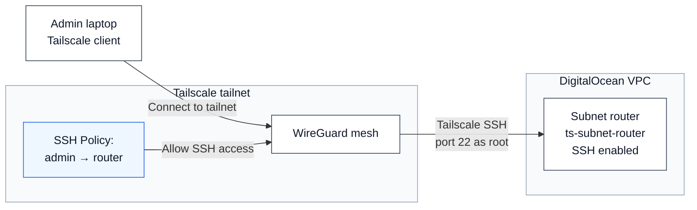
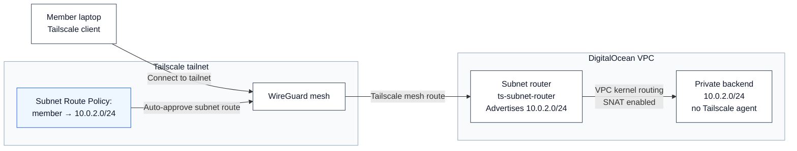

This repo builds a small DigitalOcean lab for Tailscale subnet routing.

The subnet router runs Tailscale and advertises the private VPC range. The backend does not run Tailscale; it stays reachable only through the advertised subnet route.

## Quick Start (Prerequisites)

Before deploying, you'll need:

1. **DigitalOcean Account**
   - Create account at https://www.digitalocean.com
   - Generate a Personal Access Token: https://docs.digitalocean.com/reference/api/create-personal-access-token/

2. **Tailscale Account**
   - Create a tailnet at https://login.tailscale.com (free)
   - Create an OAuth application for Terraform: https://tailscale.com/kb/1215/oauth-clients
   - Record your OAuth Client ID and Client Secret

3. **Local Setup**
   - Install Terraform >= 1.5.0: https://www.terraform.io/downloads

## Concepts

**Tailnet**: Your private, encrypted Tailscale network. All devices connected to your tailnet can reach each other through WireGuard encryption, regardless of physical location or network.

**Subnet Routing**: Instead of installing Tailscale on every backend server, the subnet router acts as a gateway. It advertises private subnets (like your DigitalOcean VPC `10.0.2.0/24`) to your tailnet. Tailscale users then access those subnets through the router without needing an agent on the backend.

**Why This Architecture**: The backend has zero Tailscale footprint—no agent, no process, no attack surface. Members access it through encrypted, authenticated subnet routes managed entirely by the router. The backend only sees traffic from the VPC, protected by a network firewall.

## Architecture

### Flow 1: Admin SSH Access



### Flow 2: Member Subnet Route Access



## Access Model

| Source | Destination | Access |
|--------|-------------|--------|
| `autogroup:admin` | `tag:subnet-router` | Tailscale SSH on port 22 as `root` |
| `autogroup:member` | `10.0.2.0/24` | Subnet-routed traffic to the VPC range |
| Backend host | Public internet inbound | Blocked by DigitalOcean firewall |

Network access is defined with Tailscale grants. Tailscale SSH still uses the separate `ssh` policy section because that is how Tailscale models SSH authorization.

The backend is agentless, so `tailscale ssh` is not expected to work on the backend. Use normal protocols against the backend private IP after the subnet route is active.

One operational note: the member grant is for the full `10.0.2.0/24` route. Keep router services closed on its VPC interface unless members should be able to reach them through the private subnet.

## Security Model

**Defense in Depth**:
- **Identity Layer**: OAuth2 via Tailscale controls who joins your tailnet
- **Encryption Layer**: WireGuard encrypts all traffic between clients and router
- **Network Layer**: DigitalOcean VPC isolates the backend from the public internet
- **Firewall Layer**: DigitalOcean firewall allows inbound traffic only from VPC CIDR `10.0.2.0/24`
- **Access Control Layer**: Tailscale ACLs enforce role-based policies (admin vs member)
- **Router Gateway**: Single point of control for all subnet-routed traffic (SNAT enabled for hairpin safety)

**Backend Attack Surface**:
- ❌ No public IP → not directly exposed to internet
- ❌ No Tailscale agent → no Tailscale process to compromise
- ❌ Firewall blocks non-VPC traffic → only router can initiate connections
- ✅ Only reachable through encrypted Tailscale mesh + VPC kernel routing

## Files

| File | Purpose |
|------|---------|
| `.gitignore` | Prevent committing sensitive Terraform state and credentials |
| `cloud-config.yaml` | Cloud-init template for router bootstrap (install Tailscale, enable forwarding, advertise route) |
| `providers.tf` | Terraform provider versions and provider setup |
| `tailscale.tf` | Tailscale auth key, grants, SSH policy, and route auto-approval |
| `digitalocean.tf` | VPC, subnet router, backend droplet, firewall, and outputs |

## Deploy

1. Set environment variables:

```bash
export DIGITALOCEAN_TOKEN="your_do_personal_access_token"
export TAILSCALE_OAUTH_CLIENT_ID="your_ts_oauth_client_id"
export TAILSCALE_OAUTH_CLIENT_SECRET="your_ts_oauth_client_secret"
```

2. Initialize and deploy:

```bash
terraform init
terraform plan              # (optional) review changes
terraform apply             # will prompt for confirmation
```

Or use `-auto-approve` to skip confirmation:

```bash
terraform apply -auto-approve
```

## Verify

Get the backend private IP:

```bash
terraform output backend_private_ip
```

With Tailscale disconnected, the backend private IP should not respond:

```bash
ping <backend_private_ip>
```

Reconnect Tailscale and try again:

```bash
ping <backend_private_ip>
```

Admins can SSH to the router through Tailscale:

```bash
tailscale ssh root@ts-subnet-router
```

## After Deploy

Once `terraform apply` completes, verify deployment:

```bash
terraform output
```

You should see:
- `router_public_ip`: Public IP of the subnet router
- `backend_private_ip`: Private VPC IP of the backend (only accessible via Tailscale subnet route)

**In your Tailscale console** (https://login.tailscale.com/admin/machines):
- A new machine named `ts-subnet-router` should appear
- It should have tag `tag:subnet-router` 
- Status should show advertised routes: `10.0.2.0/24`

**Next steps**:
- Admin: SSH to router and verify subnet forwarding is enabled: `cat /proc/sys/net/ipv4/ip_forward` (should be `1`)
- Members: Ping the backend: `ping <backend_private_ip>` (should respond once Tailscale connects)
- Admins: SSH to backend through private IP: `ssh root@<backend_private_ip>` (if you add SSH keys)

## Validation & Expected Output

This infrastructure has been validated and tested:

- ✅ Terraform plan/apply succeeds with correct provider versions
- ✅ Cloud-init syntax validated
- ✅ ACL policy tested and working
- ✅ Subnet routing verified (backend reachable through router gateway)
- ✅ Tailscale SSH access confirmed

### Expected Results

**Terraform Outputs**:
```
router_public_ip = "192.0.2.xxx"
backend_private_ip = "10.0.2.xxx"
```

**Tailscale Console**:
- Machine `ts-subnet-router` appears online
- Tag `tag:subnet-router` assigned
- Route `10.0.2.0/24` advertised and approved

## Troubleshooting

**Router failed to come online**:
- Check cloud-init logs on the droplet: `sudo tail -f /var/log/cloud-init-output.log`
- Verify auth key is valid in Tailscale console

**Backend not reachable**:
- Confirm router is online and advertised route shows `10.0.2.0/24`
- Check firewall rules: backend should allow inbound from VPC CIDR
- On your laptop: `tailscale status` should show `ts-subnet-router` as a peer

**SSH fails**:
- Verify you're in `autogroup:admin` in your Tailscale account settings
- Check ACL on your tailnet console: `autogroup:admin` should have access to `tag:subnet-router`

## Cleanup

Destroy everything:

```bash
terraform destroy -auto-approve
```

Or remove only the DigitalOcean resources and leave the Tailscale policy/state in place:

```bash
terraform destroy \
  -target=digitalocean_droplet.subnet_router \
  -target=digitalocean_droplet.backend_target \
  -target=digitalocean_firewall.backend_isolation \
  -target=digitalocean_vpc.subnet_vpc
```

Note: Tailscale resources (ACL policy, auth key) remain in your tailnet and can be re-used for future deployments.
